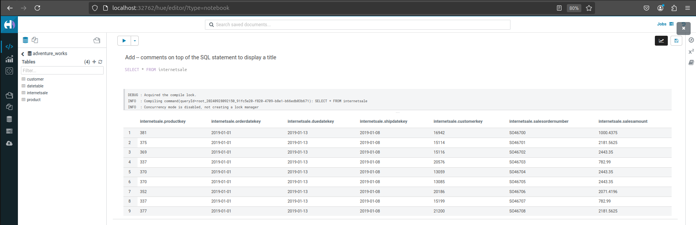

# Data Lake Project

## Introduction

This project sets up a data lake architecture using various distributed services. It enables the storage and processing of large datasets in a scalable and efficient manner. The key components include **Apache Hadoop** for distributed storage, **Hive** for metadata management and querying, **Apache Spark** for distributed data processing, and **Airflow** for orchestrating workflows. The services are containerized using **Docker** to streamline deployment and management.

## Key Components

- **Postgres**: A relational database used as the metadata store for Hive Metastore and Airflow.
- **Adminer**: A simple database management tool for interacting with Postgres.
- **Hadoop (Namenode & Datanode)**: A distributed file system (HDFS) for storing large datasets.
- **Hive Metastore**: A central metadata repository for Apache Hive, storing metadata for tables and partitions.
- **Hive Server**: Provides an interface for querying data stored in HDFS using HiveQL.
- **Hue**: A web-based UI to interact with Hadoop, Hive, and other components.
- **Apache Spark**: A distributed computing framework for processing large-scale data.
- **Airflow**: A platform for orchestrating and scheduling workflows.

## Architecture

The architecture consists of various services that are deployed using Docker and connected through a common network. These services interact to form the foundation of a scalable and efficient data lake.

The following diagram illustrates the system architecture:


## Airflow Pipeline

Airflow orchestrates the data pipeline, which is responsible for scheduling and managing data workflows. Below is an example of the Airflow pipeline:


## Hue Query Example

The Hue interface allows users to query data stored in the data lake. Here's an example of a query executed using the Hue UI:



## Services Overview

- **Postgres**:

  - Metadata store for Hive Metastore and Airflow.
  - Access on port `32769`.

- **Adminer**:

  - Web-based UI for managing the Postgres database.
  - Access via [http://localhost:32767](http://localhost:32767).

- **Hadoop (Namenode & Datanode)**:

  - Distributed file system for large-scale data storage.
  - Namenode accessible on port `9870`.

- **Hive Metastore**:

  - Centralized metadata store for Hive.
  - Accessible on port `9083`.

- **Hive Server**:

  - Query engine for executing HiveQL queries on HDFS data.
  - Accessible on port `10000`.

- **Hue**:

  - Web UI for interacting with Hadoop, Hive, and other services.
  - Access via [http://localhost:32762](http://localhost:32762).

- **Apache Spark**:

  - Distributed computing engine for data processing.
  - Spark Master accessible on port `8082`.

- **Airflow**:
  - Workflow orchestration tool for scheduling and managing data pipelines.
  - Access via [http://localhost:8080](http://localhost:8080).

## Prerequisites

- **Docker** and **Docker Compose** must be installed on your system.
- Ensure the necessary ports (e.g., `8080`, `9000`, `9870`, etc.) are free on your machine.

## Installation

1. **Clone the Repository**:

   ```bash
   git clone <repository-url>
   cd <repository-directory>
   ```

2. **Start the Services**:

   To start the services, use:

   ```bash
   make start
   ```

3. **Check Service Health**:

   All services come with built-in health checks. To view logs and service status, use:

   ```bash
   docker-compose logs -f
   ```

## Usage

### Accessing Services

- **Airflow**: [http://localhost:8080](http://localhost:8080)
- **Hue**: [http://localhost:32762](http://localhost:32762)
- **Adminer**: [http://localhost:32767](http://localhost:32767)

### Querying Data

1. Use **Hue** to query data stored in HDFS via Hive.
2. Use **Spark** for distributed data processing and transformations.
3. Orchestrate complex workflows with **Airflow**, including data ingestion, processing, and transformation tasks.

### Stopping Services

To stop the services, use:

```bash
make stop
```

### Data Persistence

All data is stored in Docker volumes to ensure persistence across container restarts. The following directories are mapped for persistent storage:

- Postgres data: `./mnt/postgres/data`
- HDFS Namenode: `./mnt/hadoop/namenode`
- HDFS Datanode: `./mnt/hadoop/datanode`
- Hive Metastore warehouse: `./mnt/hive/warehouse`
- Spark apps and data: `./mnt/spark/apps`, `./mnt/spark/data`
- Airflow configuration and DAGs: `./mnt/airflow`

Ensure these directories exist and have proper permissions before running the containers.

## Troubleshooting

- **Failed Service Start**: Ensure that the necessary ports are not being used by other services.
- **Health Check Failures**: Use `docker-compose logs <service_name>` to inspect the logs and identify any issues.

## Future Improvements

- Integrate additional tools like **Prometheus** and **Grafana** for monitoring.
- Add more complex Spark-based ETL workflows.
- Implement data governance tools for better data management.
